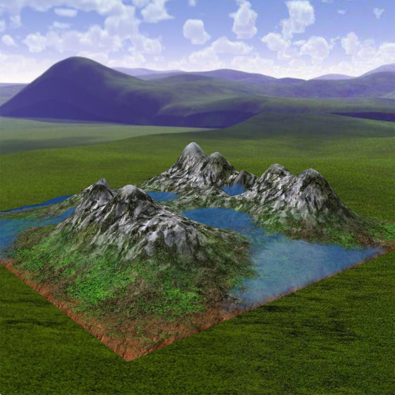
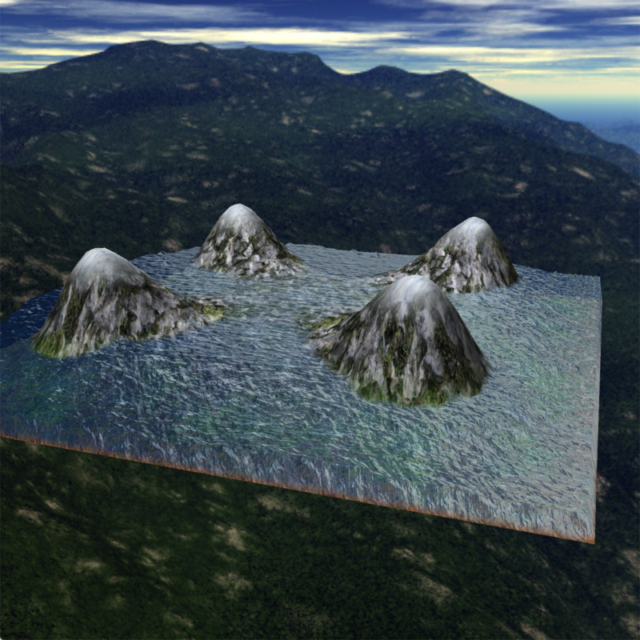
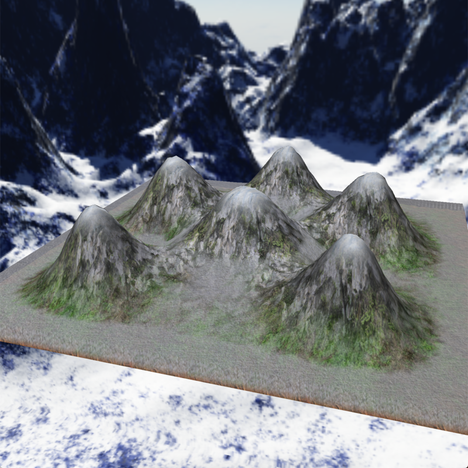

# Water and terrain simulation

## Basics

- C++11

- OpenGL 2.1

- GLSL 1.20

## Dependencies

- glfw 3.3.2

- glew 2.1.0

- glm 0.9.9.5

- sfml 2.5.1

- boost 1.72.0

## Install

- make

I only tested and run this simulation on MacOS (Mojave, HighSierra, Catalina)

## Usage

./mod surface_file [water_file]

example: ./mod map/demo1.mod map/water.mod

- [ENTER] - start

- [SPACE] - stop

- [ASDW, mouse] - camera control

- [1] - water  [2] - rain  [3] - snow

- [Z] - sound  [X] - mute

- [<] - slow   [>] - fast

- [-] - leak   [+] - rise   [0] - none

